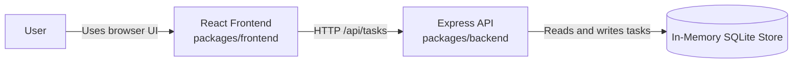
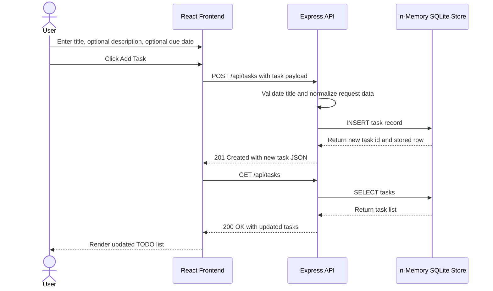

# Cloud Architecture Overview

This monorepo contains a simple TODO application with a React frontend, an Express API, and an in-memory data store. The architecture is intentionally minimal and does not depend on any cloud-provider-specific services.

## System Context

## Sequence Diagram: User Creating a TODO

